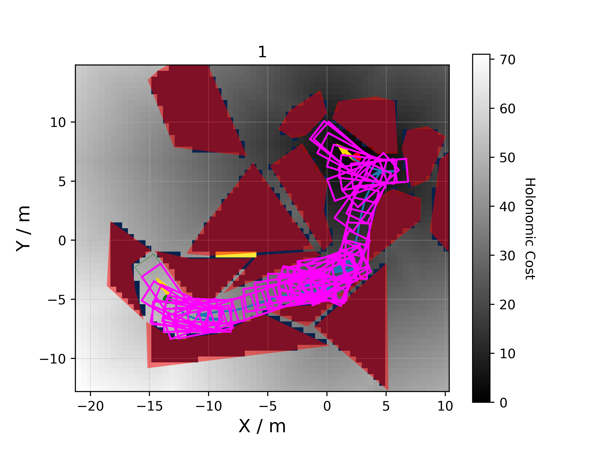

# Summary

This repo aims to apply a SOTA Hybrid A* implementation to a constrained parking benchmark.

<!--  -->

<!--  -->

# Algorithm

To understand this algorithm you must learn the following:

1. A* algorithm
2. Reeds Shepp Trajectories
3. Hybrid A* algorithm
4. General heuristics accelerating Hybrid A*

You may also find some of the data structures used in the codebase confusing, and may be worth reading about them:

1. python heapq
2. scipy.spatial.KDTree / cKDTree

## A* algorithm

[Wikipedia](https://en.wikipedia.org/wiki/A*_search_algorithm)

Found in holonomic cost map (kind of, its not the full A* algorithm, just the cost map across the grid it searches over). 

Here we discretise the space into a finite discrete set of {x,y} coordinates. We then define the cost-so-far at every point searched blah blah

## Reeds Shepp Trajectories

[Info](https://lavalle.pl/planning/node822.html)

A method of combining sequences of motion primitives into trajectories for reaching end goals from a start position without considering obstacles.

## Hybrid A* Algorithm and Heuristics

[Paper describing hybrid A* and heuristics](https://journals.sagepub.com/doi/epdf/10.1177/0278364909359210). In this case we only utilize the holonomic heuristic rather than the non-holonomic one described in the paper.

# References

[Inspiration](https://github.com/XiaojingGeorgeZhang/H-OBCA)

[Benchmark](https://tpcap.github.io/)

[Paper describing hybrid A* and heuristics](https://journals.sagepub.com/doi/epdf/10.1177/0278364909359210)

[Reeds Shepp source](https://github.com/zhm-real/CurvesGenerator/blob/master/reeds_shepp.py)